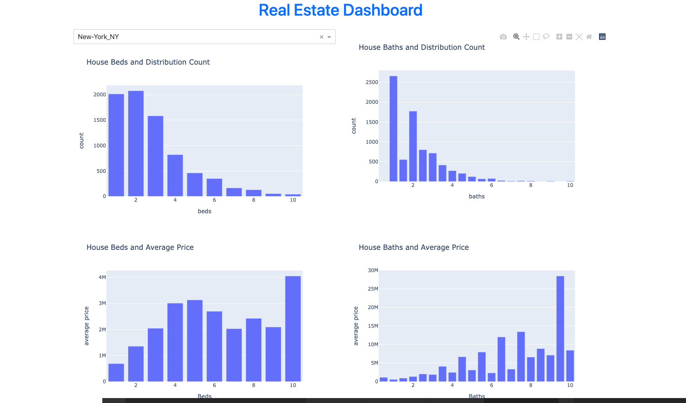
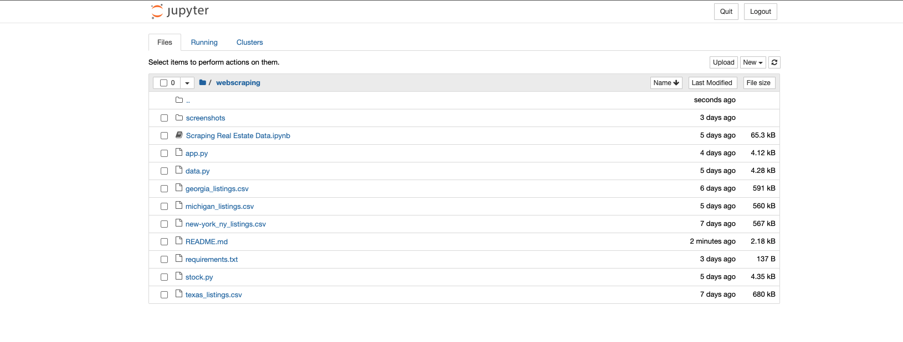
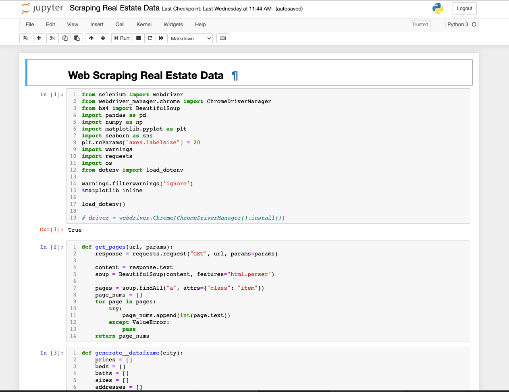

# Webscraping Realestate Project


## Tools and libraries used

- [VSCODE](https://code.visualstudio.com/):  Code editor
- [Beautifulsoup4](https://pypi.org/project/beautifulsoup4/): Is a library that makes it easy to scrape information from web pages. It sits atop an HTML or XML parser, providing Pythonic idioms for iterating, searching, and modifying the parse tree.
- [Dash](https://pypi.org/project/dash/): Trusted Python framework for building ML & data science web apps.
- [Dash Bootstrap Components](https://pypi.org/project/dash-bootstrap-components/): Is a library of Bootstrap components for use with Plotly Dash, that makes it easier to build consistently styled Dash apps with complex, responsive layouts.
- [Pandas](https://pypi.org/project/pandas/): Powerful Python data analysis toolkit
- [Jupyter](https://jupyter.org/): Open-source software, open standards, and services for interactive computing across dozens of programming languages


## Project Setup

Follow the steps below by typing the commands as shown to step up and run the application

Clone project repository to your computer

```
https://github.com/CIT-PROJECTS-2021/webscraping-realestate-project.git realestate-project
```

Change directory to `realestate-project`

```
cd realestate-project
```

Create and activate virtual environment

```
pip install virtualenv
```

```
virtualenv venv
```

On MacOs/Ubuntu Platform

```
venv/bin/activate
```

On Windows Platform

```
venv\scripts\activate.bat
```

Install dependencies

```
pip install -r requirements.txt
```

Create a free account on this webscraping platform [app.webscrapingapi.com](https://app.webscrapingapi.com/register)

Generate an `API_KEY` from the platform.

Rename `.env_example` to `.env`

COPY your `API_KEY` to the API_KEY variable located in the `.env` file.


Run the application

```
python app.py

```

Real Estate Dashboard




Open code in editor. Using Vscode here. See top to have it downloaded

```
code .
```

If you have `Jupyter notebook` installed, see above in the technology section, you can execute the notebook by running the command below

```
jupyter notebook
```




